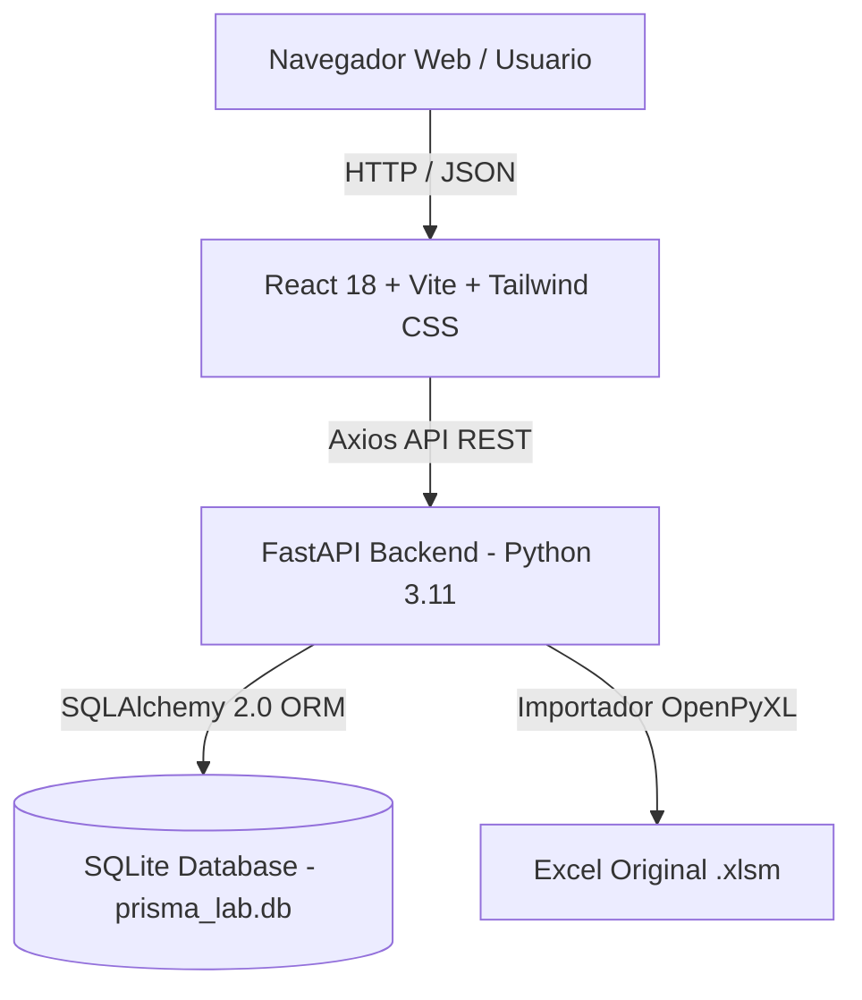

# 🚀 Sistema Integral de Producción & ERP Prisma Lab

Modernización Full-Stack local del sistema operacional basado en Excel con Macros (`Sistema_Integral_Produccion_ prisma lab.xlsm`).

---

## 🌟 Propuesta de Valor

El **Sistema Integral Prisma Lab** reemplaza hojas de cálculo complejas y propensas a errores por una **Aplicación Web Local ultrarrápida, interactiva y robusta**, diseñada específicamente para la gestión de talleres y empresas de impresión 3D:

- **100% Local & Privado**: Sin dependencias de servidores en la nube ni costos de suscripción. Opera sobre una base de datos ligera en SQLite (`prisma_lab.db`).
- **Calculadora 3D Reactiva**: Algoritmo exacto de costos en tiempo real (Materiales, Energía, Depreciación de Impresora, Mano de Obra, Gastos Adicionales y Márgenes de Ganancia).
- **Control de Inventario con Alertas en Vivo**: Seguimiento de gramos de filamento consumidos (`PETG`, `PLA`, `TPU`, `ABS`) con alertas automáticas de nivel crítico de stock.
- **Cotización & Facturación Imprimible**: Generación de documentos comerciales y exportación directa a PDF con membrete profesional.
- **Contabilidad General Automatizada (PUC)**: Generación automática de asientos contables en el Libro Diario al facturar, con validación estricta del principio de Partida Doble ($\text{Debe} = \text{Haber}$) y estados financieros (P&L / Ganancias y Pérdidas y Balance General).

---

## 🏗️ Arquitectura del Sistema



---

## 🚀 Inicio Rápido en 1-Clic

### En Windows:
Simplemente haz doble clic en `start_app.bat` o ejecuta en la consola:
```powershell
start_app.bat
```

### En Linux / macOS:
```bash
chmod +x start_app.sh
./start_app.sh
```

El script se encargará automáticamente de:
1. Crear el entorno virtual de Python en `backend/venv` e instalar las dependencias (`requirements.txt`).
2. Instalar las dependencias de Node.js en `frontend/node_modules` (`npm install`).
3. Levantar el Backend FastAPI (`http://localhost:8000`).
4. Levantar el Frontend React Vite (`http://localhost:3000`).
5. Abrir la aplicación web automáticamente en tu navegador predeterminado.

---

## 📊 Correspondencia: Hojas Excel Original vs Módulos Web

| Pestaña Excel Original | Módulo DB / Modelo FastAPI | Componente / Vista React | Descripción / Funcionalidad |
| :--- | :--- | :--- | :--- |
| `Configuracion_Costos` / `Parametros` | `SystemConfig` / `VolumeDiscount` | `Config.jsx` | Configuración de depreciación, costo kWh, mano de obra |
| `Inventario_Materiales` | `RawMaterial` | `Inventory.jsx` | Insumos de impresión 3D (PLA, PETG, TPU) y costo/gramo |
| `Inventario_Prod_terminado` | `FinishedProduct` | `Inventory.jsx` | Stock de piezas y productos terminados |
| `Calculadora_Produccion` / `Hoja3` | `ProductionCalculation` | `Production.jsx` | Calculadora reactiva 3D e histórico de 90 proyectos |
| `Cotización` / `Facturación` | `Customer`, `DocumentType`, `SalesItem` | `Sales.jsx` / `InvoicePrintView.jsx` | Cotizador interactivo y facturación con exportación PDF |
| `Libro_Diario_Mayor` / `Flujo_Caja` | `PucAccount`, `JournalEntry`, `CashFlow` | `Accounting.jsx` | Contabilidad automatizada con catálogo PUC |
| `Dashboard_Estadisticas` | Múltiples modelos agrupados | `Dashboard.jsx` | Gráficos analíticos Recharts (Donut, Barras, Líneas) |

---

## 🛠️ Matriz de Endpoints REST (FastAPI)

```text
Configuración
  GET /api/config                    - Obtener variables globales
  POST /api/config                   - Actualizar variable global
  GET /api/config/discounts          - Escala de descuentos por volumen
  GET /api/config/backup             - Descargar copia de seguridad SQLite (.db)

Inventario
  GET /api/inventory/materials       - Listar insumos / filamentos (con filtros)
  POST /api/inventory/materials      - Crear nuevo insumo de filamento
  PUT /api/inventory/materials/{id}  - Actualizar stock o costos de insumo
  GET /api/inventory/products       - Listar productos terminados

Calculadora 3D
  POST /api/production/calculate     - Calcular costos 3D y guardar proyecto
  GET /api/production                - Obtener histórico de cálculos de producción

Ventas & Facturación
  GET /api/sales/customers           - Listar clientes
  POST /api/sales/customers          - Registrar nuevo cliente
  GET /api/sales/documents           - Listar cotizaciones y facturas
  POST /api/sales/documents          - Crear cotización o factura
  POST /api/sales/documents/{id}/convert-to-invoice - 1-Click conversión a factura

Contabilidad PUC
  GET /api/accounting/puc            - Catálogo de Cuentas PUC
  GET /api/accounting/journal        - Libro Diario
  POST /api/accounting/journal       - Registrar asiento contable manual
  GET /api/accounting/cashflow       - Registro de Flujo de Caja
  GET /api/accounting/reports/pnl    - Estado de Ganancias y Pérdidas (P&L)
  GET /api/accounting/reports/balance- Balance General acumulado
```

---

## 💾 Copias de Seguridad (Backups)

Puedes generar una copia de seguridad en cualquier momento:
1. Desde la interfaz web en la vista **Configuración**, haciendo clic en *"Generar Copia de Seguridad"*.
2. El sistema creará un archivo instantáneo con sello de fecha en `backend/backups/prisma_lab_backup_YYYYMMDD_HHMMSS.db`.

---

## 🧪 Pruebas de Integración E2E

Para ejecutar la suite de prueba automatizada de ciclo de vida completo:

```powershell
python backend/tests/test_e2e_flow.py
```

*Salida esperada:*
```text
[TEST E2E] Iniciando prueba de ciclo de vida completo Prisma Lab...
  [OK] 1. Filamento Creado ID: 34 (Stock Inicial: 1000.0g)
  [OK] 2. Calculo 3D Exitoso: Costo Unitario $15,774.71 | Precio Margen $78,873.55
  [OK] 2b. Descuento en Stock Verificado: Quedan 700.0g (Descontados 300g)
  [OK] 3. Cotizacion COT-E2E-001 Creada por Total $157,747.10
  [OK] 4. Cotizacion Convertida a Factura FAC-E2E-001
  [OK] 5. Asiento Contable Verificado: Debe ($157,747.10) == Haber ($157,747.10) - Partida Doble OK!

[EXITO] PRUEBA INTEGRAL E2E COMPLETADA CON EXITO ABSOLUTO!
```

---

## 🔧 Solución de Problemas Comunes

1. **El backend dice `Address already in use` (Puerto 8000 ocupado)**:
   - Cambia el puerto ejecutando: `uvicorn app.main:app --port 8001`
2. **Error al ejecutar `npm` en PowerShell (Scripts deshabilitados)**:
   - Usa `cmd /c npm run dev` o habilita la política de ejecución con `Set-ExecutionPolicy RemoteSigned -Scope CurrentUser`.
3. **Restablecer la base de datos a los datos originales del Excel**:
   - Vuelve a ejecutar el importador: `python backend/import_excel.py`.
